<center> <h1>Easy Shopping Project Guideline</h1> </center>


# 1. Project Objectives

The project aims to integrate Mycroft (a voice assistant platform) with computer vision technology to implement an intelligent reasoning system. The system is designed for blind people to have an easier shopping experience. There are two use cases related to this scenario to help blind people find corresponding goods they demand in the supermarket using the designed Easy Shopping system.

## 1.1 Introduction 

In daily life, it is very inconvenient for blind people to travel and live alone, especially when they go to the supermarket to buy goods. It is impossible if they go shopping without other’s help. Therefore, our Easy Shopping system is designed to provide them with a personal shopping assistant to help them locate desired goods and make them enjoy shopping. To some extent, our system can partly replace the eyes. When blind people go to the supermarket, they do not need the assistance from families or staff anymore. 

## 1.2 Use Case Design

According to the introduction above, we design two use cases of this Easy Shopping project for blind people using it for shopping alone.

> Use case 1: Find the item from multiple items.

User will take a photo of the goods shelf in front of him/her. And then ask Mycroft if the item they want is in this photo. If the item they want is in the photo(in front of the user), Mycroft will also give the user a general position of that item.

> Use case 2: Get the detailed information of the item in hand.

User will take a photo of the goods in his/her hand. And then ask Mycroft what is the item in the hand. Mycroft will also give the detailed information of the goods, for example, the brand, the colour.
[img temp]

# 2. Mycroft (voice assistant) installation

## 2.1 Create your Mycroft account

You can go to the My Account page to create your own Mycroft account by using your Facebook account or your Google account or your GitHub account or by signing up with your email address and setting your password.

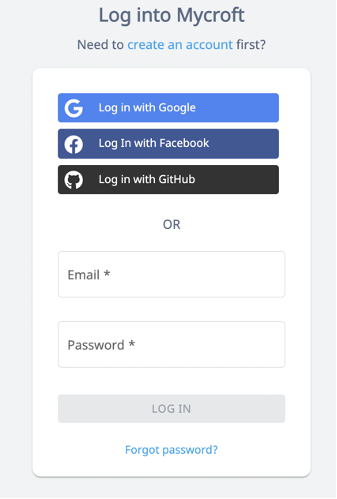

After log in, you are directed to your Mycroft Home dashboard, you are able to maintain your profile, skills, and devices here. 

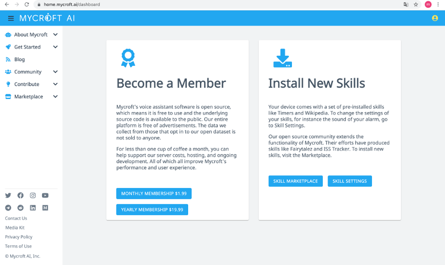

## 2.2 Install Mycroft

Before installing the Mycroft on your device, you should make sure your operating system is Linux or you have the Linux VM on your machine. If you have not installed the Linux VM yet, you may refer to the steps below to install the VM on your machine.

Steps of installing Ubuntu in VirtualBox:

When you have successfully installed Ubuntu in VirtualBox, you can start to install Mycroft in VirtualBox's base environment on your machine. You can refer to the steps below.
Steps of installing Mycroft(run below commands):

```
sudo apt-get update
sudo apt-get install -y alsa pulseaudio
git clone https://github.com/MycroftAI/mycroft-core.git
cd mycroft-core
./dev_setup.sh -fm
sudo reboot
```

## 2.3 Pair your device
Before pairing your device, you should make sure you already have a Mycroft account and you have logged into your account, if you have not created your Mycroft account, you can refer to the 2.1 to create an account.
Click the Add Device at the home.mycroft.ai account page:

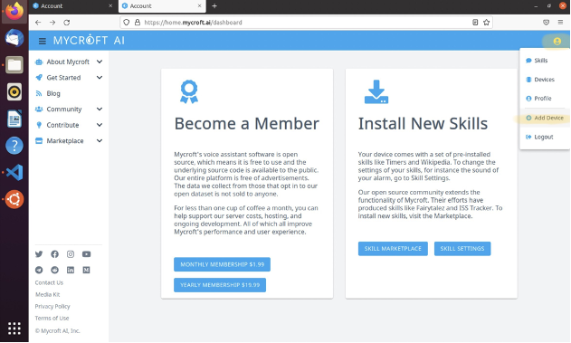

To add a device in your account, you need a 6-character Registration Code. The Registration Code will be provided when you first run start-mycroft.sh debug to start your Mycroft device.

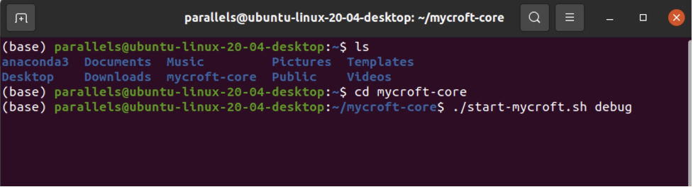


If there is no 6-character Registration Code displaying to you in CLI, you should type “pair my device” to get the 6-character Registration Code.

After you get the 6-character Registration Code(pairing code) successfully, you should use this pairing code and provide a meaningful name and location for the Device. This will help you in the future if you have multiple devices.

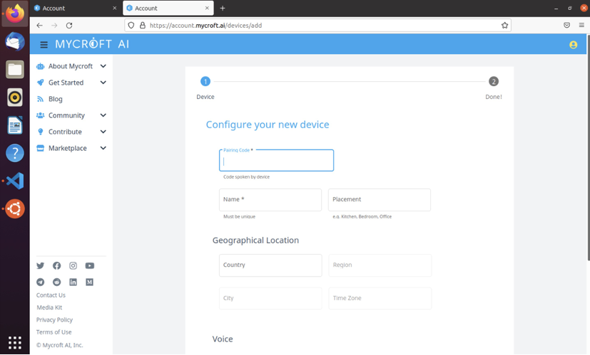

Once complete the setting, click 'NEXT' to pair the Device. Wait a few seconds, and then you'll be taken to a new screen confirming your Pairing has been successfully completed.

## 2.4 Mycroft skill

1. Install and remove Mycroft skill.
    1. From the skill Marketplace

    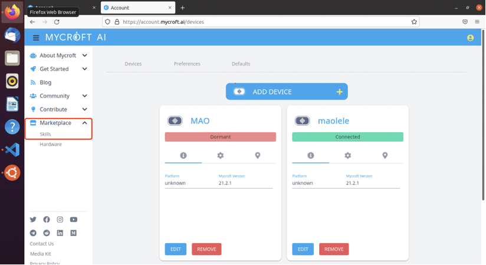


    You can use either voice installation or command line to install or remove your skill in the Marketplace. 

    Voice installation:
    You can ask Mycroft in CLI to do it for you by saying:

    *Hey Mycroft, install {skill name}* \
    *Hey Mycroft, uninstall {skill name}*
    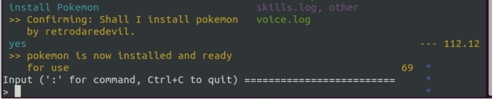
    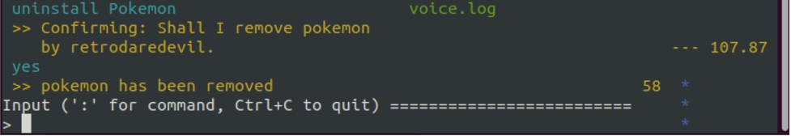

    Command line(run below commands):

    ```bash
    mycroft-msm install skill-name 
    mycroft-msm remove skill-name
    ```

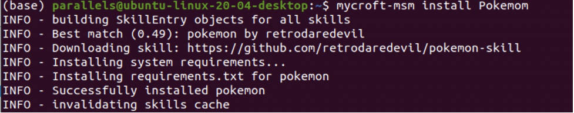
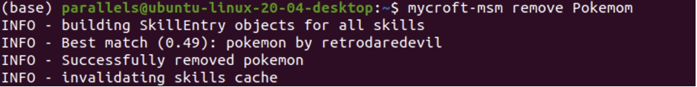

If you are in the CLI, you can use `control+c` to go back to the cmd.


2. From the Github Repository(run below commands):

```bash
mycroft-msm install github-link
mycroft-msm remove github-link
```

After installing the skills, you can ask Mycroft some questions related to the intents that the skill has.
For example:

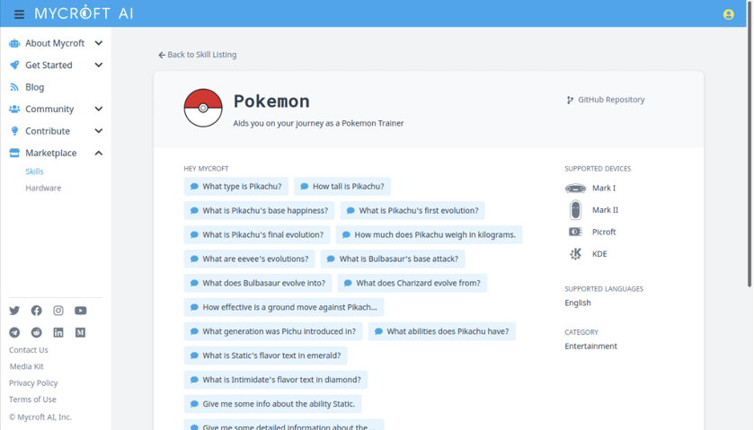

2. Get Mycroft skill information. 

    1. List all skills(run below commands):

    ```bash
    mycroft-msm list
    ```

    2. Search for a skill(run below commands):

    ```bash
    mycroft-msm search skill-name
    ```
    3. Show information(run below commands):
    ```
    mycroft-msm info skill-name
    ```

# 3. API installation

## 3.1 Google CV API
In this part, you will install a CV API for our later vision analysis. For this project, we choose a Vision AI product from Google.

### 3.1.1 Introduction
(https://cloud.google.com/vision)
Vision AI contains two products, AutoML Vision and pre-trained Vision API. AutoML Vision is for training custom vision models with your own dataset, and Vision API is a pre-trained model which can be directly used to do face detection, logo detection, object localization and so on. For a full list of the features of Vision API, you can refer to https://cloud.google.com/vision/docs/features-list.

In this project, we choose this pretrained model, Vision API.

### 3.1.2 Get use of the Vision API
Before you get use of the API, you need several steps. You need a credit card to add the payment information, but it has a free trail and won’t charge you until you upgrade.

- Step 1: Create a Google Cloud account. The account can be the same as your Google account (same email address), and you need to add payment information here.
Go to https://console.cloud.google.com/freetrial/signup/.


After you input the payment information verification, you can click START MY FREE TRIAL.

- Step 2: Go to Google Cloud Console dashboard, sign in with your google account, and create a new project.
https://console.cloud.google.com/projectselector2/home/dashboard
Click the CREATE PROJECT


Give a name to your project. Click CRATE. Here you can use easy shopping.

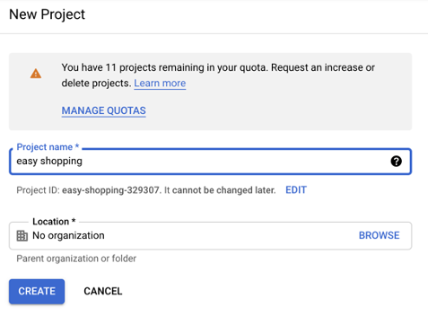

- Step 3: Enable Cloud Vision API
In the project dashboard, and make sure you are still in the ‘easy shopping’ project you just created above, click Go to APIs overview
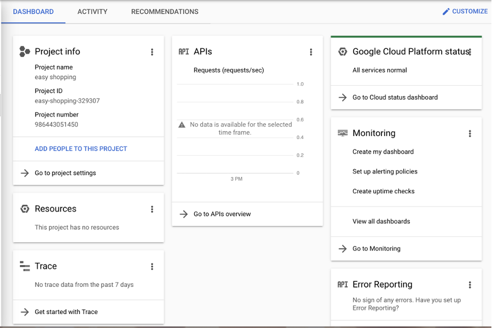

Search cloud vision API, and choose the correct one.
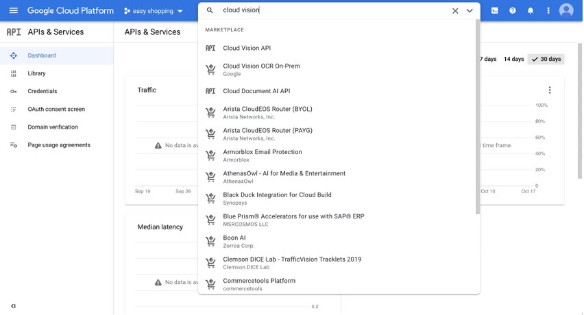

Click ENABLE to enable Cloud Vision API


- Step 4: create Google API Key
Make sure you still in the ‘easy shopping’ project, and in the ‘APIs & Services’, click ‘Credentials’, and under CREATE CREDENTIALS, choose ‘API key’
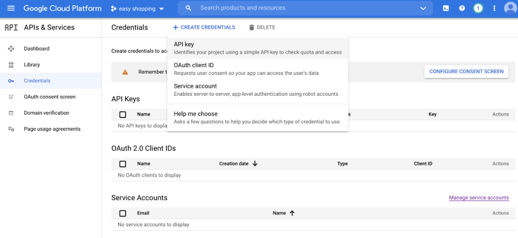
Choose CLOSE. You can copy the API key for further use.
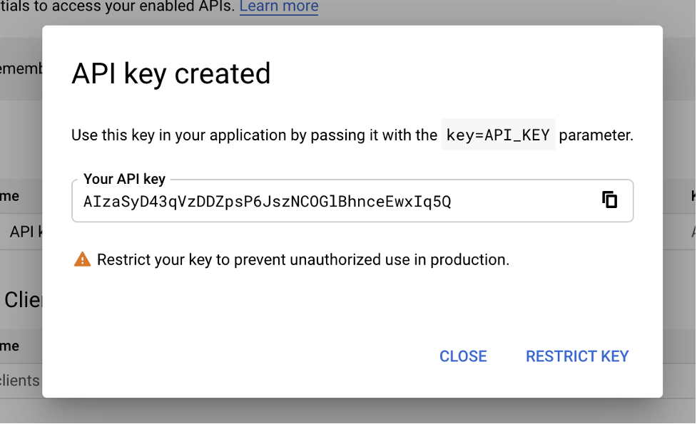

### 3.1.3 Test your Vision API

Download the project file from...

The two files you need to focus in this part are: 

> cvAPI/util.py (this file will be used in our project)
> cvAPI/test/testCVapi.py (this file is just for test)

- Step 1: Replace the key with your API key

Go to file cvAPI/util.py, in the ‘set api key’ part, assign your API key to the api_key variable.

- Step 2: Go to file test/testCVapi.py.

You can replace the image_file variable to any path of your own image. 
The major function is callAPI:
the first argument is the base64 format of the image, 
The second argument can be ‘LABEL’ or ‘LOC’, it’s used to control the response content. You can explore the difference between the two responses, it’s designed for different use cases and we will discuss it later.

If you see some response with no error, a key with ‘response’, and other information about the image, then you have successfully set up the Google Vision API.

```
{'responses': [{'labelAnnotations': [{'mid': '/m/02wbm', 'description': 'Food', 'score': 0.9862577, 'topicality': 0.9862577}, {'mid': '/m/07xgrh', 'description': 'Ingredient', 'score': 0.9086209, 'topicality': 0.9086209}, {'mid': '/m/01ykh', 'description': 'Cuisine', 'score': 0.8679337, 'topicality': 0.8679337}, {'mid': '/m/02q08p0', 'description': 'Dish', 'score': 0.8582634, 'topicality': 0.8582634}, {'mid': '/m/0p57p', 'description': 'Recipe', 'score': 0.8374579, 'topicality': 0.8374579}, {'mid': '/m/0l6sg', 'description': 'Breakfast cereal', 'score': 0.8305864, 'topicality': 0.8305864}, {'mid': '/m/022tld', 'description': 'Staple food', 'score': 0.8022431, 'topicality': 0.8022431}, {'mid': '/m/021s_r', 'description': 'Convenience food', 'score': 0.80196214, 'topicality': 0.80196214}, {'mid': '/m/0h55b', 'description': 'Junk food', 'score': 0.7742749, 'topicality': 0.7742749}, {'mid': '/m/04q6ng', 'description': 'Comfort food', 'score': 0.67553234, 'topicality': 0.67553234}]}]}
```

Then you can go back to Google Cloud Platform, go to ‘APIs & Services’, you can see some statistics of your API calls.
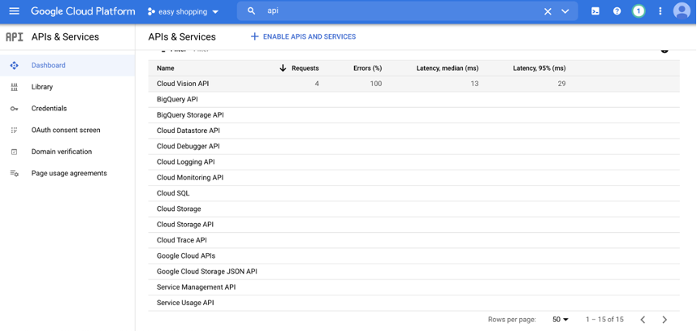

If you get a response with a key ‘error’, then you need to read the error message carefully and try to resolve it. A common error may be due to the billing.

```
{'error': {'code': 403, 'message': 'This API method requires billing to be enabled. Please enable billing on project #1025635532761 by visiting https://console.developers.google.com/billing/enable?project=1025635532761 then retry. If you enabled billing for this project recently, wait a few minutes for the action to propagate to our systems and retry.', 'status': 'PERMISSION_DENIED', 'details': [{'@type': 'type.googleapis.com/google.rpc.Help', 'links': [{'description': 'Google developers console billing', 'url': 'https://console.developers.google.com/billing/enable?project=1025635532761'}]}, {'@type': 'type.googleapis.com/google.rpc.ErrorInfo', 'reason': 'BILLING_DISABLED', 'domain': 'googleapis.com', 'metadata': {'service': 'vision.googleapis.com', 'consumer': 'projects/1025635532761'}}]}}
```

In google cloud platform, search ‘billing project’
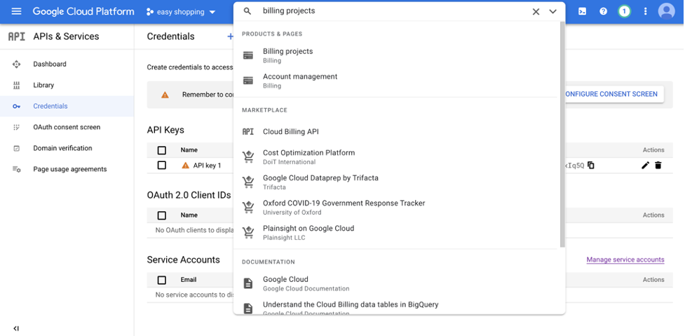

 Make sure the billing account of your project is enabled. Below is the wrong status.
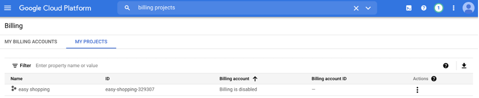

## 3.2 opencv

In this part, you will need to install the python-opencv library, this library is used to take pictures and preprocess the image.

### 3.2.1 Install OpenCV

This library needs to be installed in the virtual environment in Mycroft so that in our later development you won’t get errors.
Go to the mycroft-core folder, which you have cloned before.

```
cd ~/mycroft-core # or where ever you cloned Mycroft-core
activate the virtual environment
source venv-activate.sh
Install opencv-python
pip install opencv-python
```

### 3.2.2 test taking pictures

Go to cvAPI/test/testOpencv.py, the major function is the take_photo(). When you call the function, it opens a window to show what the camera sees, and after 50 frames, it will close the window automatically and take a picture. Then save the image in the test/photo folder, named with a time stamp.

When we later use the function in Mycroft application, it will be a little different, but the logic is the same. Now you just need to make sure your OpenCV library and camera works well.

Make sure you are still in the virtual environment of Mycroft, run the file.


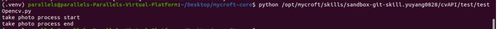

## 3.3 webcolor and Scipy

webcolor is a library used to transfer any RGB color code to a closest color name. To get the algorithm to work efficiently, we also need to use KDTree, which is under the Scipy library. 

### 3.3.1 install webcolor and Scipy

Make sure you are still in the virtual environment of Mycroft, or you can refer to the 3.2.1 install OpenCV to enter the virtual environment. Then run the command

```
pip install scipy
pip install webcolor
```

### 3.3.2 test RGB to name function
Go to cvAPI/test/testRGB2name.py.

The main function is getColorNameFromRGB(rgbTuple, xxx, xxx), the first argument is the tuple of RGB code, like (0, 0, 255). The second and third arguments are the same for all the colors, actually they are the colorbase that have all possible color names and corresponding RGB code.
If you get the 


### 3.3.3 exit the virtual environment 
Then run
```
deactivate 
```
Can exit the virtual environment
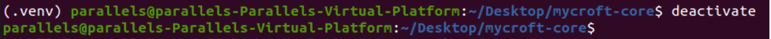

# 4. Mycroft skill development

## 4.1 Create Your Own Skill

### 4.1.1 Mycroft Skills Kit (MSK)

To set up the foundations of your own skill, you need to use the Mycroft Skills Kit (MSK) that comes installed with Mycroft. Go to the mycroft-core directory and check for the file 

mycroft-msk (for create) and mycroft-msm (for install) .

Run below commands:
```
​​cd ~/mycroft-core/bin  # or the path to your mycroft-core installation
ls
```

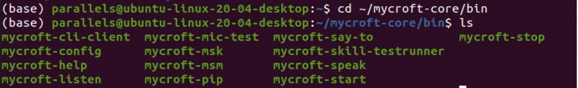

If you can see corresponding MSK files in ‘bin’ directory, you could proceed on further steps. Otherwise you need to install the required MSK.
Run below commands:
```
cd ~/mycroft-core  # or the path to your mycroft-core installation
source venv-activate.sh
pip install msk
pip install msm
```

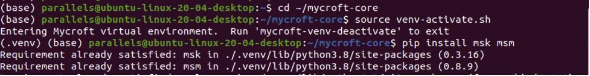


### 4.1.2  Create New Skill
Now you can use MKS to create new skills. 
Run below commands:
```
cd ~/mycroft-core  # or the path to your mycroft-core installation
msk create
```
Or just use
```
mycroft-msk create
```

If it is your first time to create a new skill, you need to configure your Github name and email address before creating a new skill. If you need to change these in the future, you can use `git --config` to modify them.


Then, you need to file up below fields:
> 1. Skill name which should be unique that different with any other skill in your device
> 2. Utterance 
> 3. Response
> 4. One line description 
> 5. Long description
> 6. Author
> 7. Color hex code  
> 8. Category
> 9. Tags
> 10. Licenses  
> 11. Python packages dependencies
> 12. Personal Access Token which you can generate against GitHub and input the field
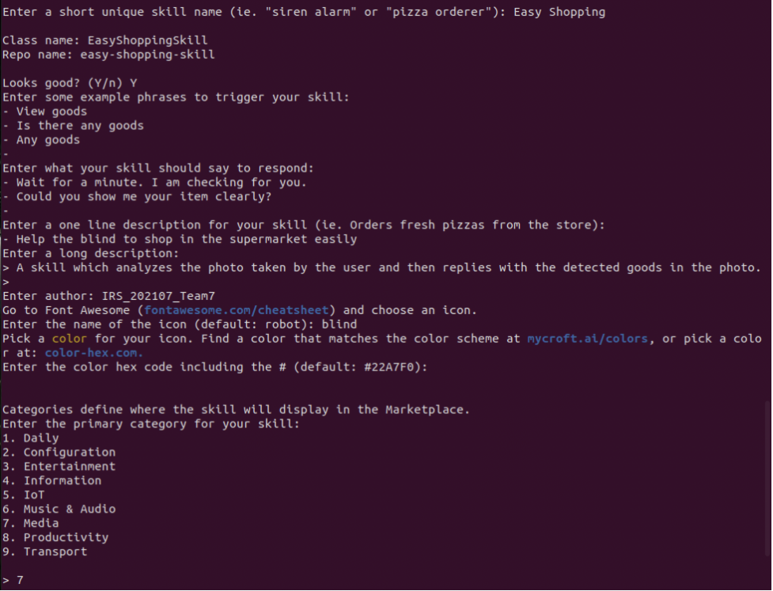
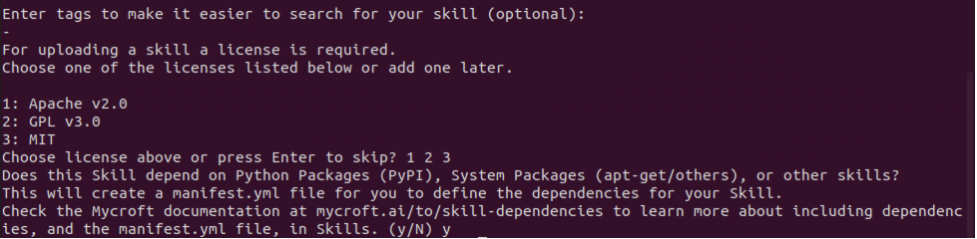

If you want to create a Github repo for the newly created skill, you need to authenticate with Github a Personal Access Token. (website: https://github.com/settings/tokens/new )


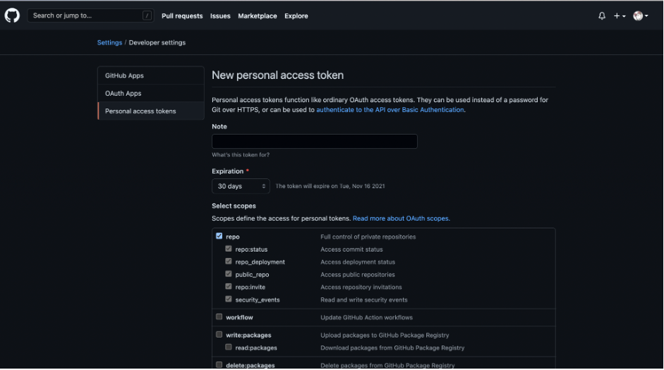
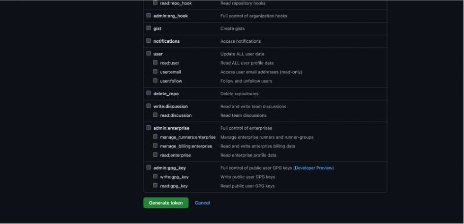
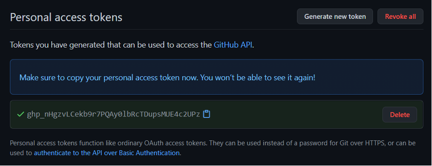

Finally, paste the token to the shell and successfully save the skill under the skill folder of mycroft `/opt/mycroft/skills`. 
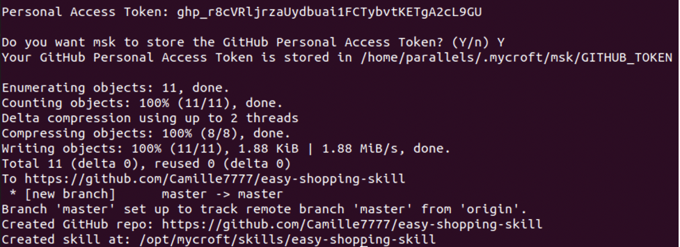

The same directory hierarchy is pushed to your GitHub repo.
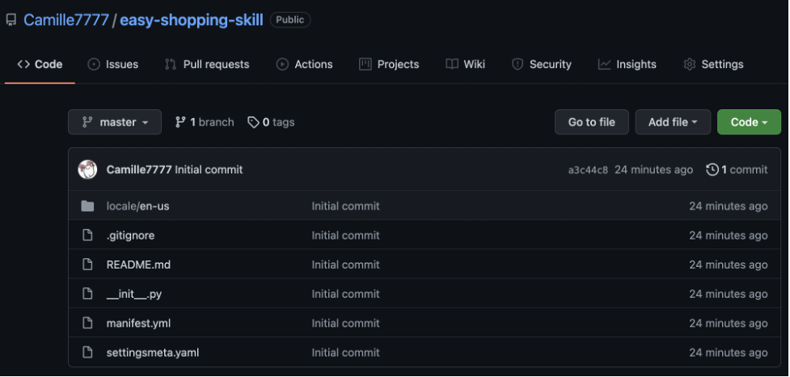

### 4.1.3 Initial Skill Structure

After creating the skill, you can navigate to the skill directory to see the initial number of files and folders. The figure below shows the structure of newly created skills, and you could check each of these in turn.

```bash
ls -l
total 20
rw-rw-r- 1 parallels parallels 337 Oct 17 16:01 _init_.py
drwxrwxr-x 3 parallels parallels 4096 Oct 17 15:57 locale
rw-rw-r- 1 parallels parallels 1009 Oct 17 16:24 manifest.yml
rw-rw-r- 1 parallels parallels 478 Oct 17 16:23 README.md
rw-rw-r- 1 parallels parallels 631 Oct 17 16:24 settingsmeta.yaml
```

1. locale directory
The  dialog, vocab, and locale directories contain subdirectories for each spoken language the skill supports. The locale is a newer addition to Mycroft and combines dialog and vocab into a single directory. It includes one file in the language subdirectory for each type of dialog the skill will use, all of the phrases you input when creating the skill, and all defined intents files.

```bash
ls l locale/en-ustotal 8-rw-rw-r- 1 parallels parallels 79 Oct 17 16:01 shopping.easy.dialog-rw-rw-r-- 1 parallels parallels 40 Oct 17 16:00 shopping.easy.intent
```


2. _init_.py
This file is where most of the Skill is defined using Python code. 
- Importing libraries

```python
from mycroft import MycroftSkill, intent_file_handler
```

- Class definition
The class definition extends the MycroftSkill class.Inside the class, methods are then defined.
```python
class EasyShopping(MycroftSkill):
```

- __init__()
This method is the constructor. It is called when the Skill is first constructed. It is often used to declare state variables or perform setup actions, however it cannot utilise MycroftSkill methods as the class does not yet exist. You don't have to include the constructor.
```python
def _init_(self): MycroftSkill.__init__(self)
```

- Intent handlers
The initialize function was used to register intents. However, in this part, @intent_handler decorator is a cleaner way to achieve this. 
```python
@intent_file_handler('shopping.easy.intent') 
def handle_shopping_easy(self, message): self.speak_dialog('shopping.easy')
```

- create_skill()
This method is to return your new skill. This is required by Mycroft and is responsible for actually creating an instance of your Skill that Mycroft can load.
```python
def create_skill(): return EasyShopping()
```

## 4.2 Intent

An intent is the task that you intend to accomplish when you say something. The role of the intent parser is to extract from your speech key data elements that specify your intent.

### 4.2.1  Padatious Intents (used in use case 1)

1. Creating Intent
Padatious uses a series of example sentences to train a machine learning model to identify an intent. Taking the ‘is there any goods’ intent as an example, if you want to respond to questions about taking goods in front of you,  you need to create an intent file named is.there.any.goods.intent under the locale/en-us/ directory. 

The sample phrases of the is.there.any.goods.intent:
```bash
is there any {category}any {category} heredo you see any {category}i want some {category}
```
These sample phrases do not require punctuation like a question mark. You can also leave out contractions such as "what's", as this will be automatically expanded to "what is" by Mycroft before the utterance is parsed. Each file should contain at least 4 examples for good modeling.

2. Defining Entities
Besides mapping many phrases to a single intent, you may need to extract specific data from an utterance. It might be a date, location, category, or some other entity. In the above examples, the {category} is some specific data required to be extracted from the utterance. These are wild-cards where matching content is forwarded to the skill's intent handler later.

3. Creating the Intent Handler
The intent_handler() decorator can be used to create a Padatious intent handler by passing in the filename of the .intent file as a string. Continuing with the  example, you need to import the decorator before it is used and also register an intent using is.there.any.goods.intent  file.
```python
from mycroft import MycroftSkill, intent_handler
```

```python
@intent_handler('is.there.any.goods.intent')
```
4. All  Padatious Intents in EasyShoppingSkill
EasyShoppingSkill includes two padatious intents in total. The figure belows shows the corresponding setup.

```python
@intent_handler('view.goods.intent')
def handle_view_goods(self, message):
    self.speak('Taking a photo now. Please wait a second for me to get the result.')
    self.speak('I find some goods here, you can ask me whatever goods you want.')

@intent_handler('is.there.any.goods.intent')
def handle_is_there_any_goods(self, message):
    category_label = message.data.get('category')
    str = 'yes, I find ' +  category_label + ' in front of you'
    self.speak(str)
```

Check with Mycroft that your padatious intents are successfully created.
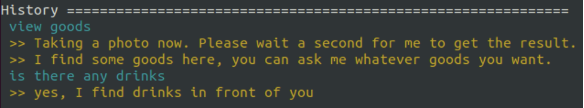

### 4.2.2 Adapt Intents(used in use case 2)

1. Defining keywords and entities

- vocab(.voc) files
Vocab files define keywords that Adapt will look for in a Users utterance to determine their intent.
The vocab files are located under the `locale/en-us/` directory. 

The vocab files can have one or more lines to list synonyms or terms that have the same meaning in the context of this Skill. Mycroft will match any of these keywords with the Intent.

- Consider a simple Brand.voc. Within this file, it might includes:

```txt
brand
brands
```

If the user speaks either brand or brands, Mycroft will match this to any Adapt Intents that are using the Brand keyword.


2. Creating the intent handler
To construct an Adapt Intent, we use the @intent_handler decorator  and pass in the Adapt IntentBuilder.

We must import two lines below before we create the intent handler.

```python
from mycroft import MycroftSkill, intent_handler
from adapt.intent import IntentBuilder
```

The IntentBuilder is then passed the name of the Intent as a string, followed by one or more parameters that correspond with one of our .voc files.

```python
@intent_handler(IntentBuilder('AskItemBrand').require('Brand').build())
```

The Brand keywords are required, It must be present for the intent to match.
There is another situation, when you require at least one of the keywords in the intent, you can use one_of().

For example:

```python
@intent_handler(IntentBuilder('IntentName').one_of(‘Brand’, ‘Color’))
```
You will see the details of this later.

3. Including Adapt intents in EasyShoppingSkill
In the EasyShoppingSkill, there are 7 intents in this skill. The picture below shows how to include the Adapt intents in this skill. 

```python
@intent_handler(IntentBuilder('ViewItemInHand').require('ViewItemInHandKeyWord'))
def handle_view_item_in_hand(self, message):
    self.speak('Taking a photo now. Please wait a second for me to get the result.')
    self.speak('The item is possible to be something. You can ask me any details about the item now, such as brand, color or complete information.')


@intent_handler(IntentBuilder('AskItemCategory').require('Category').build())
def handle_ask_item_category(self, message):
    self.speak('I am talking about the category of the item')

@intent_handler(IntentBuilder('AskItemColor').require('Color').build())
def handle_ask_item_color(self, message):
    self.speak('I am talking about the color of the item')

@intent_handler(IntentBuilder('AskItemBrand').require('Brand').build())
def handle_ask_item_brand(self, message):
    self.speak('I am talking about the brand of the item')

@intent_handler(IntentBuilder('AskItemKw').require('Kw').build())
def handle_ask_item_keywords(self, message):
    self.speak('I am talking about the keywords of the item')

@intent_handler(IntentBuilder('AskItemInfo').require('Info').build())
def handle_ask_item_complete_info(self, message):
    self.speak('I am speaking the complete information of the item')

@intent_handler(IntentBuilder('FinishOneItem').require('Finish').build())
def handle_finish_current_item(self, message):
    self.speak('Got you request. Let\'s continue shopping!')
```

Check with Mycroft that all your adapt intents are successfully created.

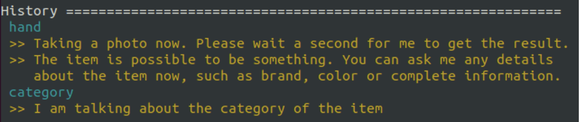
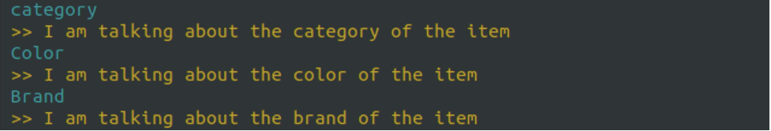
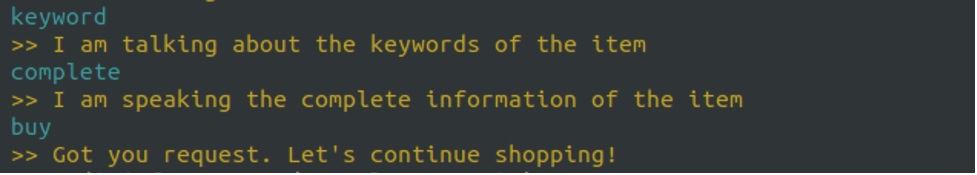

## 4.3 Statement

A statement is any information spoken by Mycroft to the User.

### 4.3.1 Simple statement
The first intent with the EasyShoppingSkill, view.goods.intent handels the inquiries, take.photo.dialog provides the statements for Mycroft to speak in reply to that inquiry.

Sample contents of the Intent and dialog files:

- view.goods.intent: view goods
- take.photo.dialog: Taking a photo now. Please wait a second for me to get the result.

```python
@intent_handler('view.goods.intent')
def handle_view_goods(self, message):
    self.speak_dialog('take.photo')

```
There are two intents which need the simple statement in the EasyShoppingSkill. One is Padatious Intent, the other is Adapt Intent. 

Padatious Intent: view.goods.intent

Adapt Intent: FinishOneItem

Check with Mycroft that all simple statements can work successfully.
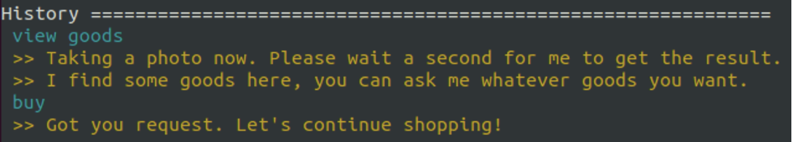


### 4.3.2 Statements with variables

Compared to the above simple statement, the .dialog file of statements with variables includes a variable named type. The variable is a placeholder in the statement specifying where text may be inserted. The speak_dialog() method accepts a dictionary as an optional parameter. If that dictionary contains an entry for a variable named in the statement, then the value from the dictionary will be inserted at the placeholder's location. Taking the above ‘is there any goods’ intent as an example, there are two .dialog files for this intent, which are yes.goods.dialog and no.goods.dialog.

is.there.any.goods.intent
```txt
is there any {category}
any {category} here
do you see any {category}
i want some {category}
```

yes.goods.dialog
```txt
yes, I find some {category} at {location} in front of you
yes, there is the {category} at {location}
yes, {category} (are|is) at {location} in front of you
```

no.goods.dialog
```txt
sorry, I don't find any {category} here 
no, there is no {category}
```

The {category} and {location} are variables embedded in the statement. Making a simple conversation as an example, when you utter “Is there any Milk”, the first of the four intent lines “is there any {category}” is recognized by mycroft, and the value ‘Milk’ is returned in the message dictionary assigned to the 'category_label' entry. The line category_label = message.data.get('category') extracts the value from the dictionary for the entry ‘category_label’ and converts all characters in lower case. In this case, the variable ‘category_label’ will receive the value ‘Milk’, and speak_dialog() will be called with yes.goods.dialog or no.goods.dialog based on whether the ‘category_label’ is matched with anyone in label_list. If there exists matched item, the statement from yes.goods.dialog might be randomly selected, and after insertion of the value ‘Milk’ for the placeholder variable {category} and ‘left top’ for the placeholder variable {location}, Mycroft would says ‘yes, I find some milk at left top in front of you’.


```python
@intent_handler('is.there.any.goods.intent')
def handle_is_there_any_goods(self, message):
    # in real application, label_str and loc_list will return from CV API
    label_list = [['milk', 'drink', 'bottle'], ['milk', 'drink', 'bottle']]
    loc_list = ['left top', 'right top']

    category_label = message.data.get('category')
    detected = 0

    for i in range(len(label_list)):
        label_str = generate_str(label_list[i])
        label_str = label_str.lower()

        if category_label is not None:
            if category_label in label_str:
                self.speak_dialog('yes.goods',
                            {'category': category_label,
                            'location': loc_list[i]})
                detected = 1
                break
        else:
            continue

    if detected == 0:
        self.speak_dialog('no.goods',
        {'category': category_label})
```

There are several intents using the statements with variables, including Padatious Intent and and Adapt Intents. 

Padatious Intent: is.there.any.goods.intent
Adapt Intent: ViewItemInHand, AskItemCategory, AskItemColor, AskItemBrand, AskItemKw, AskItemInfo

Check with Mycroft that all statements with variables can work successfully.

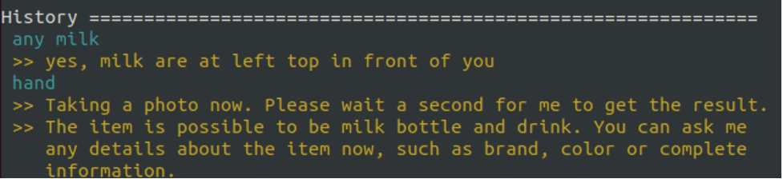
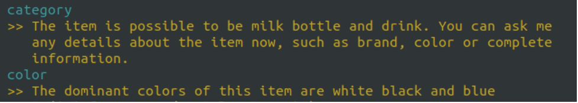
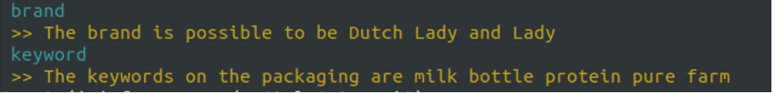
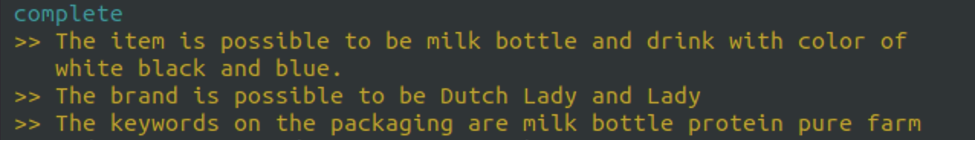


## 4.4 Conversational context
Until now, you have created intents and statements so that you can do basic interaction with Mycroft. However, the problem is that the intent order matters. In both cases, the users should ask Mycroft to take a photo first then ask other questions. In Mycroft, you can add context to deal with this.

### 4.4.1 Add context and remove context
Unfortunately, context is currently only available with the Adapt Intent Parser, and is not yet available for Padatious. Let’s first use context to deal with the intent order in use case 2.

Let’s review use case 2 again. The relationship among the intents in use case 2 is shown in the figure below. 

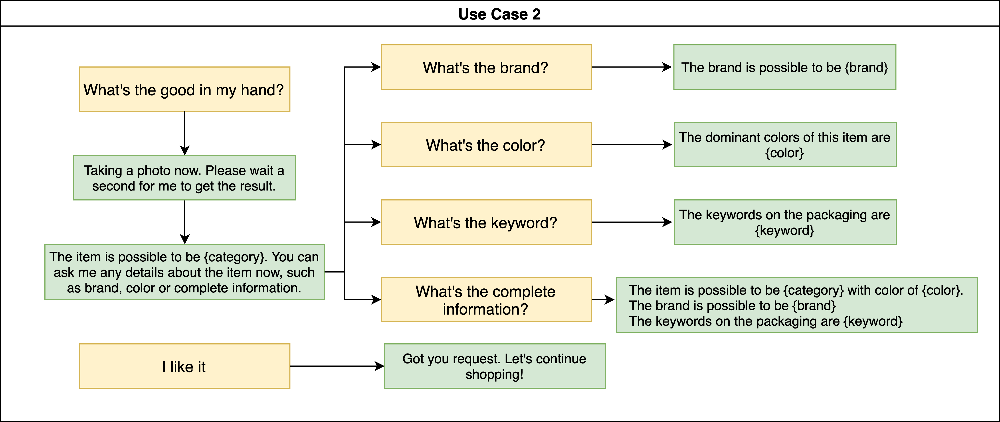

Context can be added in one intent, and removed in one intent. And before the user invokes an intent, Mycroft can check whether the context exists or not.
Then the solution is that, you need to add one context in `ViewItemInHand`, then `AskItemCategory`, `AskItemColor`, `AskItemBrand`, `AskItemKw`, `AskItemInfo` should have this context to be invoked. The context won’t be removed until the user invokes `FinishOneItem` intent.
1. Add context

There are two ways to add context. 

- Use @adds_context() decorator.
- Use self.set_context() method.

You might use the second way in this project, since use in a method is more flexible. Later you will see in the integration part, you will do some justification before adding the context. Now you can do this in `ViewItemInHand` intent.

```python
@intent_handler(IntentBuilder('ViewItemInHand').require('ViewItemInHandKeyWord'))
def handle_view_item_in_hand(self, message):
    self.speak_dialog('take.photo')
    self.img_multi = ''
    self.img_hand = ''
    
    # suppose we use camera to take a photo here, 
    # then the function will return an image path
    self.img_hand = '/opt/mycroft/skills/sandbox-git-skill.yuyang0828/photo/2.jpeg'

    # suppose we call CV API here to get the result, 
    # the result will all be list, then we use generate_str() to create string
    self.category_str = generate_str(['milk', 'bottle', 'drink'])
    self.brand_str = generate_str(['Dutch Lady', 'Lady'])
    self.color_str = generate_str(['white', 'black', 'blue'])
    self.kw_str = ' '.join(['milk', 'bottle', 'protein', 'pure', 'farm'])

    # set the context
    self.set_context('getDetailContext')

    # speak dialog
    self.speak_dialog('item.category', {'category': self.category_str})
```

2. Add context requirement in intent handler
Before invoking some intents, you need to tell Mycroft to check whether the context exists or not. You can do this in the `@intent_handler` decorator.

```python
@intent_handler(IntentBuilder('AskItemBrand').require('Brand').require('getDetailContext').build())
def handle_ask_item_brand(self, message):
    self.handle_ask_item_detail('brand', self.brand_str)
```

Do this for `AskItemCategory`, `AskItemColor`, `AskItemBrand`, `AskItemKw`, `AskItemInfo` and `FinishOneItem`

3. Remove context
Similar to adding context, there are two ways to remove context. Since you won’t do any other justification in the  `FinishOneItem` intent, i.e. once the user invokes the `FinishOneItem` intent, the context must be removed, you can use decorator style this time.

```python
@intent_handler(IntentBuilder('FinishOneItem').require('Finish').require('getDetailContext').build())
@removes_context('getDetailContext')
def handle_finish_current_item(self, message):
    self.speak('Got you request. Let\'s continue shopping!')
    self.types_str = ''
    self.color_str = ''
    self.logo_str = ''
    self.kw_str = ''
    self.img_hand = ''
    self.img_multi = ''
```

4. Add one more intent to handle no context

It’s not a necessary step, like when a user invokes `AskItemBrand` before `ViewItemInHand`, Mycroft will say that *I don’t understand what you are saying*. However, you can handle this situation and remind the user to say *view hands* before asking the brand.
Just add one more intent after the previous intent. It won’t need the context.

```python
@intent_handler(IntentBuilder('NoContext').one_of('Category', 'Color', 'Brand', 'Kw', 'Info'))
def handle_no_context2(self, message):
    self.speak('Please let me have a look at what\'s on your hand first.')
```

### 4.4.2 Another way to control the order

Now you need to deal with the order problem of Padatious intent. 
Similarly, let’s review the use case 1 and their order relationship.
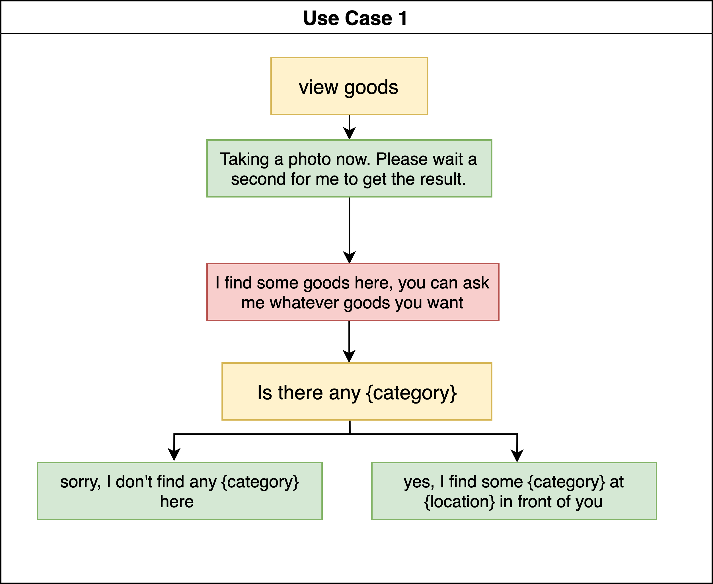
Since we cannot use context this time, we use another variable to mark whether the user has invoked the intent or not. 

- Step 1: add one variable self.img_multi in the __init__()

```python
def __init__(self):
    MycroftSkill.__init__(self)
    self.category_str = ''
    self.color_str = ''
    self.brand_str = ''
    self.kw_str = ''
    self.img_multi = ''
    self.img_hand = ''
    self.log.info(LOGSTR + "_init_ EasyShoppingSkill")
```

- Step2: `self.img_multi` will have some value after the user takes a picture (this will be done in the integration part). Now you can just give any image path to the variabel.

```python
@intent_handler('view.goods.intent')
def handle_view_goods(self, message):
    self.speak_dialog('take.photo')
    self.img_multi = ''
    self.img_hand = ''

    # suppose we use camera to take a photo here, 
    # then the function will return an image path
    self.img_multi = '/opt/mycroft/skills/sandbox-git-skill.yuyang0828/photo/multi.jpeg'

    self.speak('I find some goods here, you can ask me whatever goods you want.')
```

- Step3: add justification in `is.there.any.goods.intent`

```python
@intent_handler('is.there.any.goods.intent')
def handle_is_there_any_goods(self, message):
    if self.img_multi == '':
        # if self.img_multi == '', 
        # then it means that user hasn't invoked intent(handle_view_goods)
        self.handle_no_context1(message)
    else:
        ...
```

- Step4: handle_no_context1()
It’s still not a necessary step, just for better user experience. If the user invokes the intent in the wrong order, give some reminder.

```python
def handle_no_context1(self, message):
    self.speak('Please let me have a look at what\'s in front of you first.')
```

## 4.5 Prompts

A prompt is any question or statement spoken by Mycroft that expects a response from the User.

### 4.5.1 Add prompts for Yes/No Questions

- ask_yesno() is for checking if the response contains "yes" or "no" like phrases.

- If "yes" or "no" responses are detected, then the method will return the string "yes" or "no". If the response does not contain "yes" or "no" vocabulary then the entire utterance will be returned. If no speech was detected indicating the User did not respond, then the method will return None.

- Let’s look at the ask_yesno() in the use case 1.

```python
def handle_no_context1(self, message):
    self.speak('Please let me have a look at what\'s in front of you first.')
    # add prompts
    take_photo = self.ask_yesno('do.you.want.to.take.a.photo')
    if take_photo == 'yes':
        self.handle_view_goods(message)
    elif take_photo == 'no':
        self.speak('OK. I won\'t take photo')
    else:
        self.speak('I cannot understand what you are saying')
```

In the above code, you have asked the user if they want to take a photo, Mycroft will then speak the sentence in the do.you.want.to.take.a.photo.dialog whether they respond yes or no. You may also speak some error dialog if neither yes or no are returned.

The ​​EasyShoppingSkill uses `ask_yesno()` two times, one is in the use case 1, another is in the use case 2.

### 4.5.2 Add expect_response parameter for returning responses to the intent parser

So far you have looked at ways to prompt the User, and return their response directly to our Skill. It is also possible to speak some dialog, and activate the listener, directing the response back to the standard intent parsing engine. You may do this to let the user trigger another Skill, or because you want to make use of your own intents to handle the response.

For implementing this, you can use the expect_response parameter in the `speak_dialog()` method.

```python
def handle_ask_item_detail(self, detail, detail_str):
    if detail_str == '':
        # add expect_response
        self.speak_dialog(
        'cannot.get', {'detail': detail}, expect_response=True)
    else:
        dialog_str = 'item.' + detail
        # add expect_response
        self.speak_dialog(dialog_str, {detail: detail_str}, expect_response=True)
```

The above example `speak_dialog()` tells the user other things they can do with their Mycroft device while they have been told the item’s detailed information, for example the brand, the colour. 

# 5. Integration

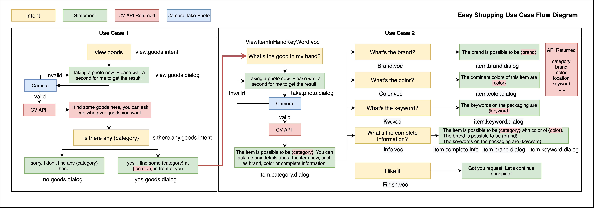

## 5.1 Add camera

### 5.1.1 Create a function called take_photo()

```python
def take_photo(img_queue):
    '''
    Do taking photo
    '''
    LOG.info(LOGSTR + 'take photo process start')
    cap = cv2.VideoCapture(0)
    img_name = 'cap_img_' + str(time.time()) + '.jpg'
    img_path = '/opt/mycroft/skills/sandbox-git-skill.yuyang0828/photo/' + img_name

    #<-- Take photo in specific time duration -->
    cout = 0
    while True:
        ret, frame = cap.read()
        cv2.waitKey(1)
        cv2.imshow('capture', frame)
        cout += 1 
        if cout == 50:
            img_queue.put(img_path)
            cv2.imwrite(img_path, frame)
            break

    cap.release()
    cv2.destroyAllWindows()
    LOG.info(LOGSTR + 'take photo process end')
    os._exit(0)
```

Using the `take_photo()` function, the photo will be taken in a specific time duration. Later this photo will be used in the Google cv api. 

5.1.2 Integrating take_photo in the use cases
Use case 1:

```python
@intent_handler('view.goods.intent')
def handle_view_goods(self, message):
    self.speak_dialog('take.photo')
    self.img_multi = ''
    self.img_hand = ''

    # step 1.2: create another process to do the photo taking
    img_queue = Queue()
    take_photo_process = Process(target=take_photo, args=(img_queue,))
    take_photo_process.daemon = True
    take_photo_process.start()
    take_photo_process.join()
    self.img_multi = img_queue.get()

    self.speak('I find some goods here, you can ask me whatever goods you want.', expect_response=True)
```

use case 2 should also add `take_photo()` function, similar as use case 1.

## 5.2 Add cv api

### 5.2.1 cv api exploration

There are two cv functions you can use. 

1. getObjLabel.py
This is for use case 1. It will detect all the objects in the image and get the position of every object. Then crop the image according to the objects’ position and call Google Vision API again to get the labels for every object. This method will call API multiple times, so it may be time 
consuming sometimes.

The return will be an object, with two keys, `objectNum` and `objectList`. 

Value of `objectNum` is an `int`

Value of `objectList` is a list of objects.

The sample structure of the return is as below.

```json
{
    objectNum: 2, 
    objectList:[
        {name:[‘milk’, ‘bottle’, ‘drink’], location:‘lower right’},
        {name:[‘milk’, ‘bottle’, ‘drink’], location:’upper left’}
    ]
}
```

2. getDetail.py

This is for use case 2. It will just call the API once to get the information of the item in the image.

The return will be one object. There are four keys, `objectLabel`, `objectLogo`, `objectText` are all string lists. `objectColor` is an object list.
The structure of the return is as follows.

```json
{
    objectLabel:[],
    objectLogo:[],
    objectText:[],
    objectColor:[
	    {'colorName’:’blue’, ‘rgb’:[0,0, 0]}
    ]
}
```

### 5.2.2 Integration with cv api

Now it’s time to replace some variable value with the cv api return.
You can add the try-catch block when calling API since sometimes some error may return.

Also, in the testing stage, you may not have an environment to take pictures to do the detection, you can use some existing images. (`MODE` variable in below can handle whether to use the pictures taken by camera or not)

```python
@intent_handler('is.there.any.goods.intent')
def handle_is_there_any_goods(self, message):
    if self.img_multi == '':
        self.handle_no_context1(message)
    else:
        # use try-catch block here, since there maybe error return from the cv api
        try:
            self.log.info(LOGSTR + 'actual img path')
            self.log.info(self.img_multi)
            if MODE == 'TEST':
                self.log.info(LOGSTR + 'testing mode, use another image')
                self.img_multi = '/opt/mycroft/skills/sandbox-git-skill.yuyang0828/photo/multi.jpeg'

            objectlist = getObjLabel.getObjectsThenLabel(self.img_multi)
            label_list = []
            loc_list = []
            detected = 0

            category_label = message.data.get('category')

            for obj in objectlist['objectList']:
                label_list.append(obj['name'])
                loc_list.append(obj['loc'])
        
        
            for i in range(0,len(label_list)):
                label_str = generate_str(label_list[i])
                label_str = label_str.lower()
        
                if category_label is not None:
                    if category_label in label_str:
                        self.speak_dialog('yes.goods',
                                    {'category': category_label,
                                    'location': loc_list[i]})
                        detected = 1
                        break
                else:
                    continue

            if detected == 0:
                self.speak_dialog('no.goods',
                {'category': category_label})

        except Exception as e:
            self.log.error((LOGSTR + "Error: {0}").format(e))
            self.speak_dialog(
            "exception", {"action": "calling computer vision API"})

```

The above code example is for use case 1. Do the similar thing for use case 2.

## 5.3 add dependency

Now you are almost done!

When you were developing this project, you installed some python packages. It will be inconvenient to the user if they need to download the packages manually. 

So you can add dependency files in your git repository, then when other users git clone your skill, Mycroft will do the dependency downloading automatically.

Mycroft gives two options to the dependency file,

- manifest.yml: The default method. This can include all three types of dependencies including variations for different operating systems if required.
- requirements.txt: Used only for Python packages.
- requirements.sh: Used to run a custom script during installation.
Since you are using only python packages, the simplest way is to use requirements.txt.

In requirements.txt,

```txt
webcolors
scipy
opencv-python
```
